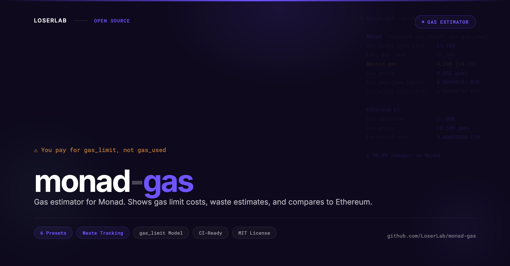

# monad-gas

<p align="center">
  
</p>

Gas estimator for [Monad](https://monad.xyz). Shows gas limit costs, waste estimates, and compares Monad vs Ethereum.

> **Warning:** Monad charges gas based on `gas_limit`, not `gas_used`. Unlike Ethereum, there are no refunds for unused gas. Accurate gas estimation saves real money on Monad.

## Install

```bash
npx monad-gas
```

Or install globally:

```bash
npm install -g monad-gas
monad-gas
```

## Why this exists

Gas on Monad works differently from every other EVM chain:

- **You pay for gas_limit, not gas_used.** On Ethereum, unused gas is refunded. On Monad, you pay `gas_price * gas_limit` regardless of actual consumption. No refunds.
- **Estimation accuracy = money saved.** Setting gas_limit too high wastes MON. Setting it too low reverts the transaction (and you still pay).
- **400ms blocks at 10,000 TPS.** Monad's parallel execution engine means gas dynamics differ from sequential EVM chains.

`monad-gas` estimates gas for common transaction types, shows exactly how much you'd waste at different gas limit multipliers, and compares costs against Ethereum L1.

## Usage

```bash
# Estimate gas for all common transaction types
npx monad-gas

# Estimate a specific preset
npx monad-gas -p transfer
npx monad-gas -p swap

# Custom transaction
npx monad-gas --to 0x... --data 0x...

# Set gas limit multiplier (lower = cheaper, riskier)
npx monad-gas --multiplier 1.1

# Include USD pricing
npx monad-gas --mon-price 5.50 --eth-price 2500

# JSON output (for CI/CD)
npx monad-gas --json

# Skip Ethereum comparison
npx monad-gas --no-compare

# Custom RPC
npx monad-gas --rpc https://your-rpc.com
```

## Presets

| Preset | Description |
|---|---|
| `transfer` | Simple MON send |
| `erc20-transfer` | ERC-20 token transfer |
| `erc20-approve` | ERC-20 token approval |
| `swap` | DEX swap (Uniswap-style) |
| `nft-mint` | NFT mint (ERC-721) |
| `deploy` | Contract deployment |

## Monad Gas Model

On Monad, the total transaction cost is:

```
cost = gas_price x gas_limit
```

There are **no refunds** for unused gas. This differs from Ethereum where:

```
cost = gas_price x gas_used  (unused gas is refunded)
```

This means gas estimation accuracy directly impacts your costs. The `--multiplier` flag controls how much buffer is added above the estimated gas usage:

- `1.0` = exact estimate (risky, may fail)
- `1.1` = 10% buffer (tight)
- `1.2` = 20% buffer (default, safe)
- `1.5` = 50% buffer (wasteful)

## Programmatic API

```typescript
import { estimateGas, compareGas } from "monad-gas";

const estimate = await estimateGas(
  { to: "0x...", data: "0x..." },
  { monadRpc: "https://rpc.monad.xyz" }
);

console.log(estimate.gasLimit);         // What you pay for
console.log(estimate.estimatedGasUsed); // What you actually use
console.log(estimate.wastePercent);     // How much you're overpaying
```

## Part of the Monad Developer Toolkit

| Tool | What it does |
|------|-------------|
| [monad-audit](https://github.com/LoserLab/monad-audit) | Catch EVM incompatibilities and gas model gotchas in your Solidity contracts |
| **monad-gas** (this tool) | Estimate gas costs on Monad vs Ethereum |

## License

MIT
